# 50 Design Styles Every Designer Should Know for Better Prompting

**Learn the design language that AI understands and turn your aesthetic intuition into clear, powerful prompts.**

*By Himanshu Bhardwaj | UX Planet | August 1, 2025*

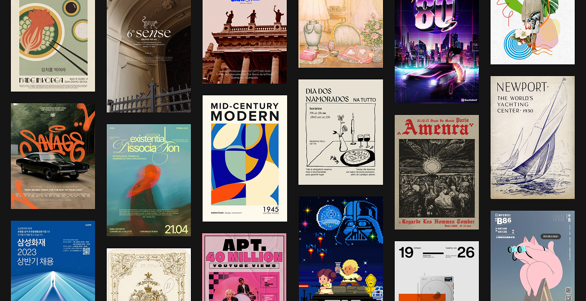

In this era of AI-generated visuals, chances are you must have tried to create something stunning. Well, I did too. But when I typed what I thought was a great prompt, the result looked nothing like my vision.

> The problem wasn't the AI. It was the lack of a shared visual vocabulary.

As designers, we often talk about color, layout, or typography and we generally think or imagine in moods for instance "clean," "dreamy," "grunge" , but AI doesn't understand ambiguity. What it needs is clarity. What it understands is **style names**.

## Why Style Language Matters (Especially in the AI Era)

Design styles are more than just aesthetic categories. They are complete ecosystems, shaped by culture, history, materials, mood, and form. When you learn them, you gain:

- A sharper eye for visual trends
- A powerful tool to direct AI output
- A way to brief collaborators with precision

Whether you're working with generative AI, ideating UI directions, or pitching a brand refresh, **style fluency can elevate your creative conversations**.

## The Problem Every Designer Hits

Lately, I found myself stuck in a weird way. Not because I lacked ideas, but because AI didn't seem to understand what I meant. That's when I started to learn about design styles and thought to document it that I now call a **visual design vocabulary**. It's a reference guide of styles that helps me write better prompts, create faster, and communicate more clearly. Not just with AI, but with clients, and other designers.

I curated this list by diving into YouTube, chatting with AI, and going down Pinterest rabbit holes.

Each design style includes:

1. **A short description** that explains its origin and intent
2. **Core identifying elements** like color palettes, typography, and layout
3. **The mood it evokes** and where **it works best**

This guide is meant to be your playground for building better visuals with intention.

---

## Design Styles Every Designer Should Know

### 1. Neoclassical

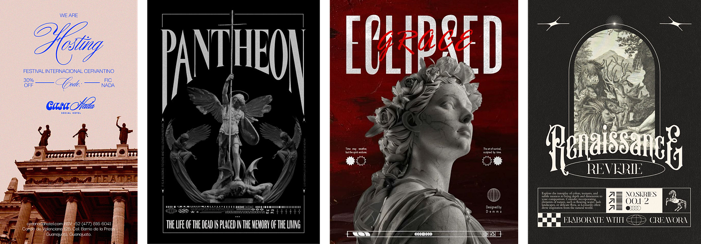

Neoclassical design is rooted in the grandeur of classical antiquity. It revives Greco-Roman ideals like order, symmetry, and refined elegance. Often used in architecture and interiors, it's now echoed in UI and brand design to communicate tradition and authority.

- **Core Elements**: Serif fonts, columns, laurel wreaths, marble textures, gold accents, symmetry, muted palettes.
- **Mood & Occasion**: Formal, timeless, noble. Ideal for luxury brands, museums, heritage products, or academic publications.

### 2. Baroque

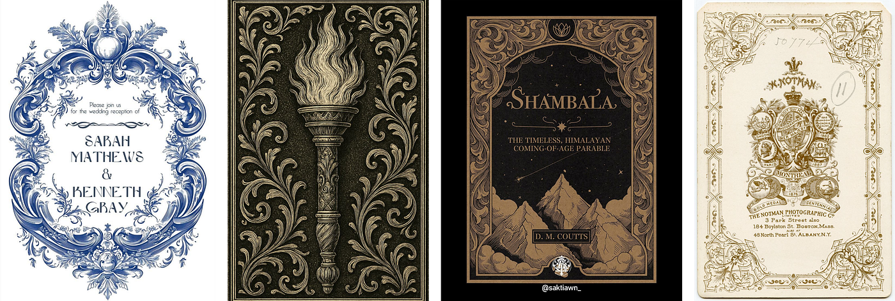

Baroque design is opulent, emotional, and dramatic. Emerging from 17th-century Europe, it thrives on excess — ornamentation, grandeur, and a theatrical sense of movement. In digital design, it shows up in highly decorative interfaces or dramatic visuals meant to awe.

- **Core Elements**: Flourishes, deep shadows, gold leaf, religious or mythological motifs, rich textiles, high contrast.
- **Mood & Occasion**: Regal, ornate, celebratory. Works well for event invitations, premium packaging, or lavish editorial designs.

### 3. Aurora

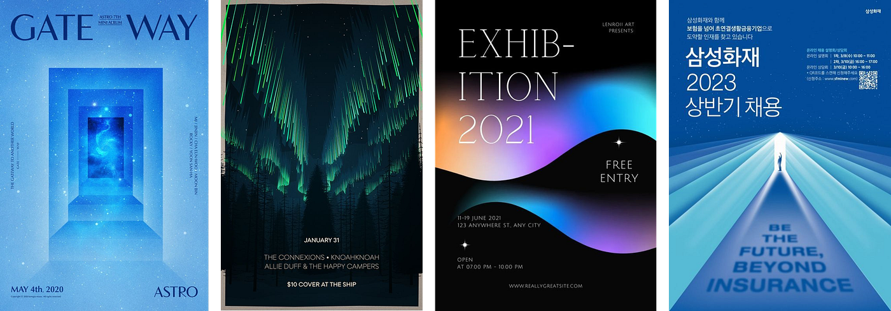

Inspired by the northern lights, Aurora style features flowing, iridescent gradients and dreamy abstractions. It's futuristic yet soft, often used in ambient digital designs or cosmic brand visuals. It reflects a sense of wonder and fluid motion.

- **Core Elements**: Iridescent gradients, blur effects, soft glows, translucent overlays, organic wave forms.
- **Mood & Occasion**: Dreamy, futuristic, meditative. Suitable for wellness apps, tech product launches, or spiritual themes.

### 4. Ethereal

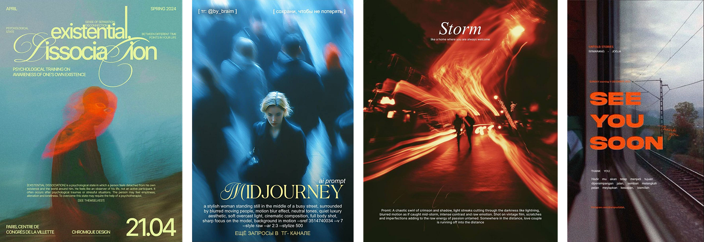

Ethereal design captures delicacy and transcendence. It feels weightless and otherworldly — like a design made of mist or light. This style emphasizes openness, airiness, and subtle beauty, often with soft pastels and faint textures.

- **Core Elements**: Light pastels, gauzy overlays, minimal serif fonts, low contrast, feathered shadows.
- **Mood & Occasion**: Calm, mystical, romantic. Works beautifully for spiritual brands, high fashion, or mindfulness interfaces.

### 5. Filigree

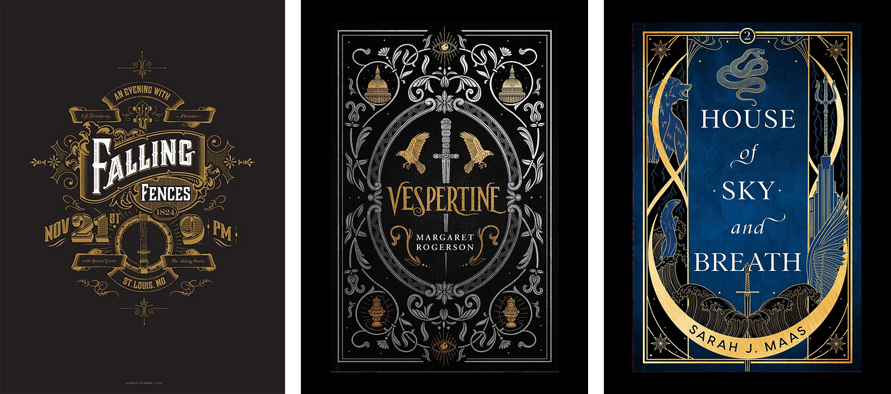

Filigree is a decorative art style characterized by intricate and delicate ornamentation — usually in gold or silver. In design, it translates to fine linework, lacy embellishments, and regal patterns that add an old-world luxury appeal.

- **Core Elements**: Delicate line patterns, metallic inks, curves, lace textures, monogram fonts.
- **Mood & Occasion**: Luxurious, vintage, ceremonial. Perfect for heritage branding, editorial layouts, or luxury packaging.

### 6. Acanthus

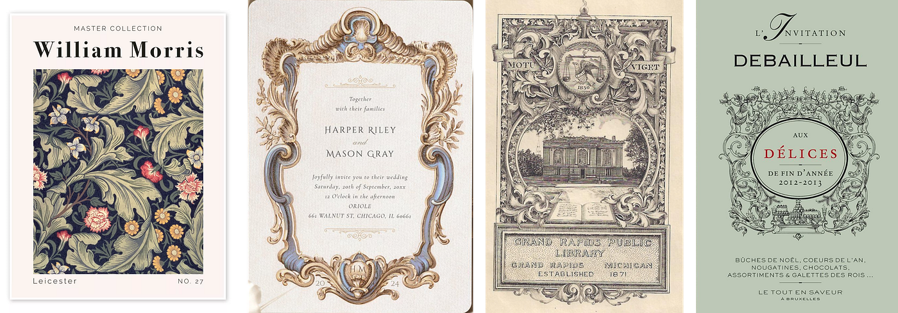

The Acanthus style is rooted in classical architectural ornamentation, inspired by the acanthus plant's foliage. Commonly seen in Corinthian columns and decorative arts, it symbolizes endurance and elegance. In design, it's used for adding a natural yet regal decorative flourish.

- **Core Elements**: Leaf motifs, flowing curves, symmetrical vines, stone textures, natural greens and golds.
- **Mood & Occasion**: Regal, organic, classical. Suitable for wedding invites, art museum branding, or premium product design.

### 7. Anthropomorphic

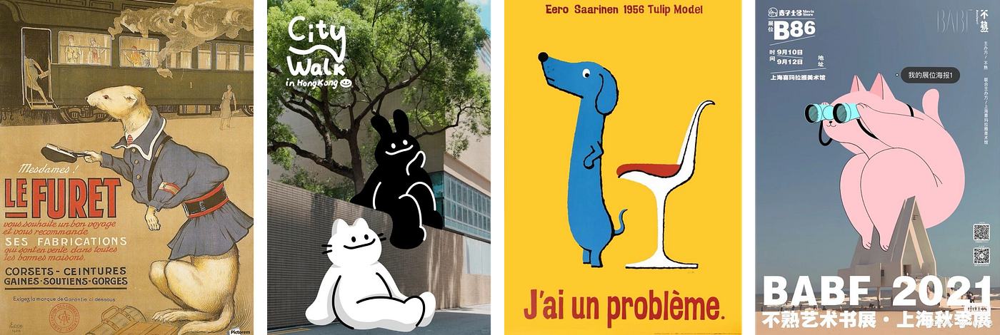

Anthropomorphic design gives human traits to non-human forms — objects, animals, or even UI elements. It adds playfulness and relatability, helping users emotionally connect with the design. Often used in mascots, illustrations, and storytelling interfaces.

- **Core Elements**: Expressive eyes, limbs on objects, character-based icons, rounded friendly shapes.
- **Mood & Occasion**: Fun, quirky, friendly. Great for children's products, gamified UX, or approachable branding.

### 8. Pixel Art

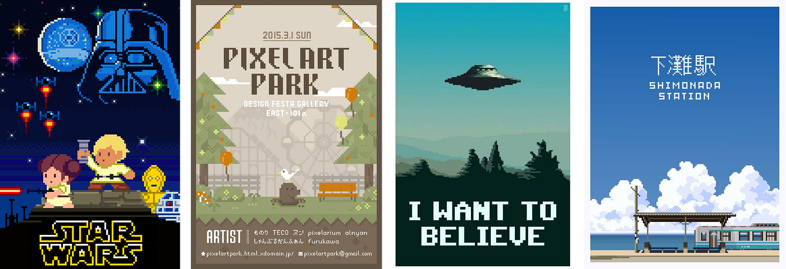

Pixel Art is a nostalgic style that harks back to early computer and video game graphics. Each image is built with visible pixels, creating a retro yet playful aesthetic. It's highly stylized and instantly communicates a love for the analog digital era.

- **Core Elements**: Grid-based visuals, low-res icons, limited color palettes, 8-bit/16-bit look.
- **Mood & Occasion**: Nostalgic, geeky, fun. Ideal for indie games, retro-themed events, or creative portfolios.

### 9. Conceptual Sketch

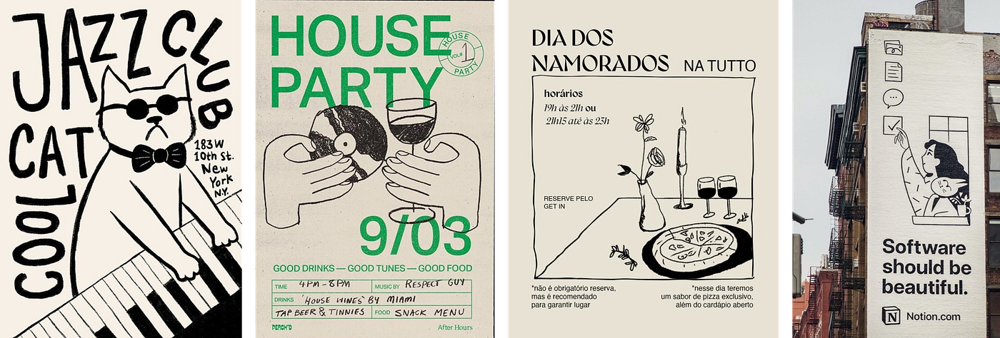

This style mimics rough hand-drawn sketches, often used in ideation or artistic branding. It emphasizes spontaneity and imagination over polish. It gives a behind-the-scenes, raw creative feel.

- **Core Elements**: Pencil/ink lines, crosshatching, greyscale tones, annotations, sketch paper texture.
- **Mood & Occasion**: Experimental, informal, idea-driven. Works well for portfolios, design journals, or brainstorming tools.

### 10. Luxury Typography

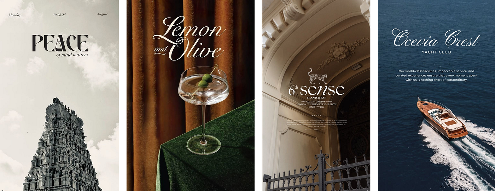

Luxury Typography relies on refined letterforms to exude elegance and class. It often pairs minimalist layout with expressive serif fonts or custom logotypes, allowing typography alone to carry the brand identity.

- **Core Elements**: Serif fonts, high letter spacing, gold foil, monochrome palettes, bespoke ligatures.
- **Mood & Occasion**: Elegant, elite, timeless. Best for luxury fashion, beauty brands, or high-end editorial design.

### 11. Japandi

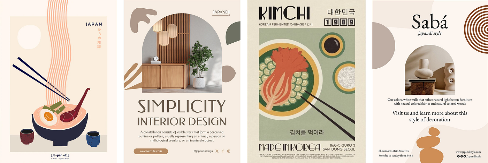

Japandi fuses Japanese minimalism with Scandinavian functionality. It focuses on simplicity, craftsmanship, and nature-inspired serenity. In UI, it translates into calm, decluttered interfaces with neutral tones and soft curves.

- **Core Elements**: Light woods, beige/gray palettes, clean sans-serif fonts, minimal icons, natural materials.
- **Mood & Occasion**: Calm, peaceful, intentional. Ideal for lifestyle brands, home decor, or meditation and wellness apps.

### 12. Memphis

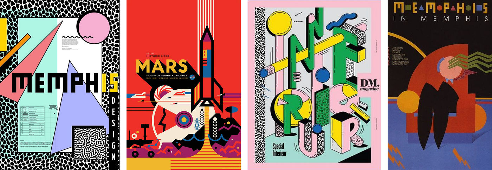

Memphis design is bold, loud, and unapologetically fun. Originating in the 1980s, it throws rules out the window with geometric shapes, high contrast colors, and abstract patterns. It's playful, rebellious, and full of attitude.

- **Core Elements**: Squiggles, bright primaries, grids, clashing colors, block shapes, cartoonish motifs.
- **Mood & Occasion**: Youthful, quirky, anti-establishment. Great for creative brands, event posters, or retro fashion.

### 13. Bohemian

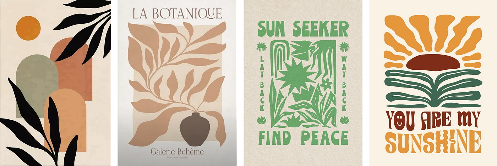

Bohemian design embraces artistic freedom and earthy charm. It's eclectic, globally inspired, and layered with patterns, textiles, and natural elements. In digital spaces, it evokes free-spirited lifestyles and wanderlust.

- **Core Elements**: Rich textures, mandalas, jewel tones, ethnic prints, script fonts, organic materials.
- **Mood & Occasion**: Free, soulful, eclectic. Ideal for handmade products, travel brands, or artisanal markets.

### 14. Shabby Chic

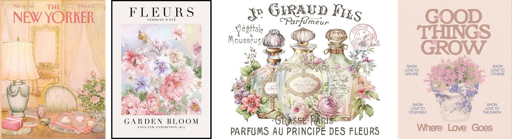

Shabby Chic combines vintage charm with feminine elegance. It often showcases distressed finishes, florals, and pastel tones. The aesthetic is lived-in yet curated, offering soft nostalgia.

- **Core Elements**: Whitewashed textures, faded florals, cursive typography, lace, soft pinks and blues.
- **Mood & Occasion**: Romantic, cozy, nostalgic. Common in weddings, vintage boutiques, and home decor.

### 15. Farmhouse / Cottagecore

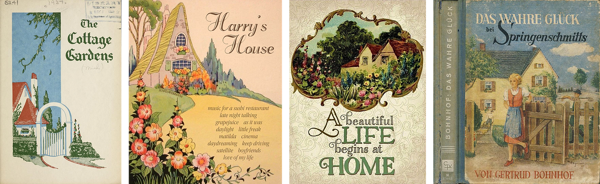

Cottagecore is a romanticization of rural life, rooted in simplicity, nature, and slow living. It often uses handmade textures and vintage rural motifs. Farmhouse adds a more rustic, American countryside twist.

- **Core Elements**: Florals, gingham, wood textures, antique finishes, serif or hand-drawn type.
- **Mood & Occasion**: Cozy, nostalgic, wholesome. Perfect for lifestyle blogs, recipe sites, or rustic home brands.

### 16. Victorian

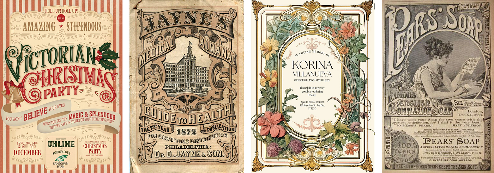

Victorian design is grand, elaborate, and deeply ornate, stemming from the aesthetics of the 19th-century British monarchy. It reflects wealth, refinement, and a love for detail — often used today for vintage or historical storytelling.

- **Core Elements**: Ornate serif fonts, damask patterns, deep reds and greens, gilded frames, heavy florals.
- **Mood & Occasion**: Opulent, historical, romantic. Ideal for book covers, tea brands, vintage fashion, or museum events.

### 17. Art Deco

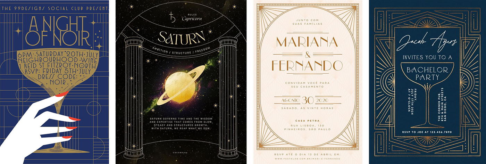

Art Deco is sleek, geometric, and sophisticated, born from the glamour of the 1920s. It combines streamlined modernism with luxurious materials and symmetrical patterns. It's both nostalgic and aspirational.

- **Core Elements**: Gold accents, sunbursts, symmetry, angular shapes, rich jewel tones, sans-serifs with flair.
- **Mood & Occasion**: Glamorous, upscale, jazzy. Perfect for luxury brands, cocktail events, or retro-modern interfaces.

### 18. Art Nouveau

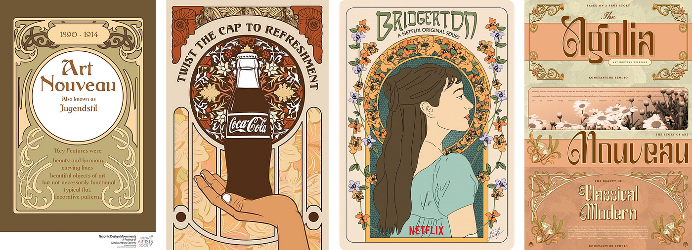

Art Nouveau is nature-inspired, fluid, and highly decorative. It celebrates organic forms — especially floral and botanical — and appears elegant and expressive. Common in poster design and decorative illustration.

- **Core Elements**: Curving lines, floral motifs, hand-lettered type, earthy palettes, stained glass patterns.
- **Mood & Occasion**: Romantic, poetic, organic. Best for artistic brands, natural cosmetics, or artisan packaging.

### 19. Mystical Western

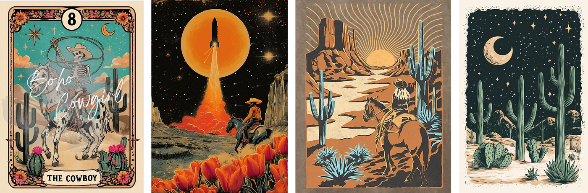

A fantasy fusion of cowboy westerns and occult mysticism, this style blends desert iconography with celestial symbols. It's rugged yet spiritual — a trending aesthetic across indie brands and metaphysical themes.

- **Core Elements**: Tarot symbols, cacti, western serif fonts, sun/moon motifs, earthy tones, leather textures.
- **Mood & Occasion**: Mystical, rugged, folklore-driven. Great for crystal shops, tarot apps, or moody music visuals.

### 20. Kitsch

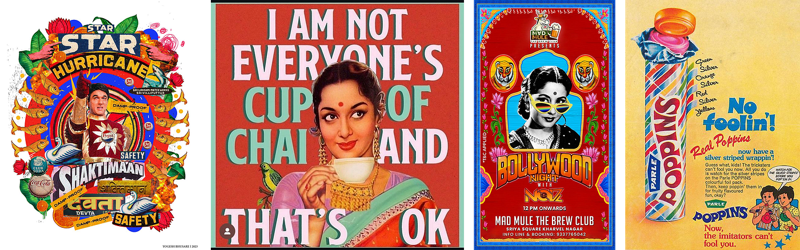

Kitsch embraces "bad taste" in an ironic, humorous way. It uses exaggerated or sentimental visuals from pop culture, often leaning into over-the-top patterns and saturated palettes.

- **Core Elements**: Clashing prints, outdated fonts, shiny plastic textures, retro advertising visuals, excess.
- **Mood & Occasion**: Campy, fun, ironic. Ideal for parody work, Gen Z fashion, or nostalgic remixes.

### 21. Y2K

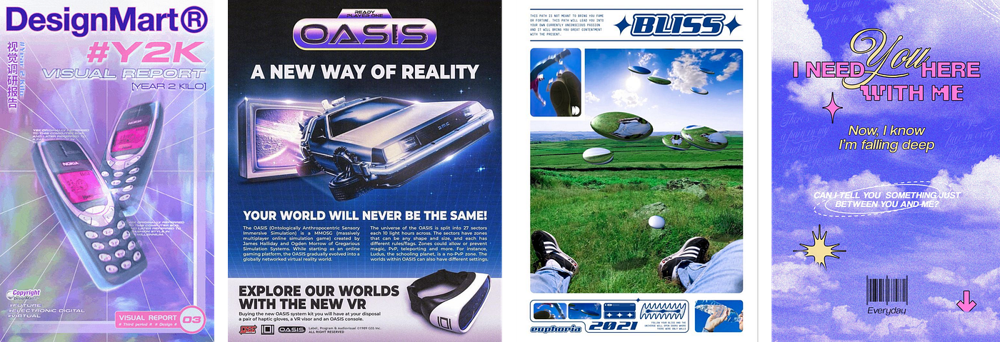

The Y2K aesthetic is inspired by late 1990s and early 2000s tech culture. It mixes cyber-futurism with millennial pop culture — think metallics, gradients, and digital gloss.

- **Core Elements**: Chrome textures, pixel fonts, metallic finishes, iridescent gradients, matrix grids.
- **Mood & Occasion**: Futuristic, nostalgic, edgy. Best for fashion branding, tech revival themes, or throwback interfaces.

### 22. Bauhaus

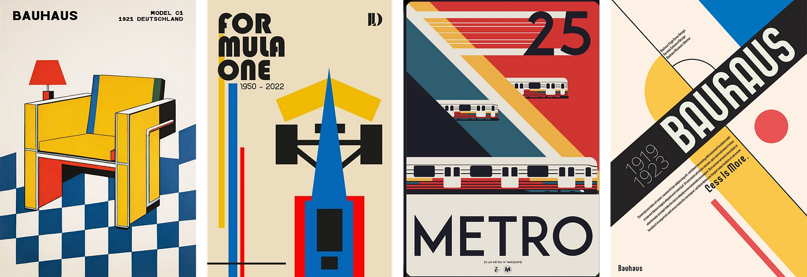

Bauhaus is functional, geometric, and minimal. Rooted in the German design school of the 1920s, it favors "form follows function" and uses basic shapes and primary colors. It's the birth of modernist design.

- **Core Elements**: Grid systems, sans-serif fonts, red-blue-yellow palette, circles/triangles/squares, minimal text.
- **Mood & Occasion**: Rational, structured, modern. Great for architecture, product design, and clean brand systems.

### 23. Brutalism

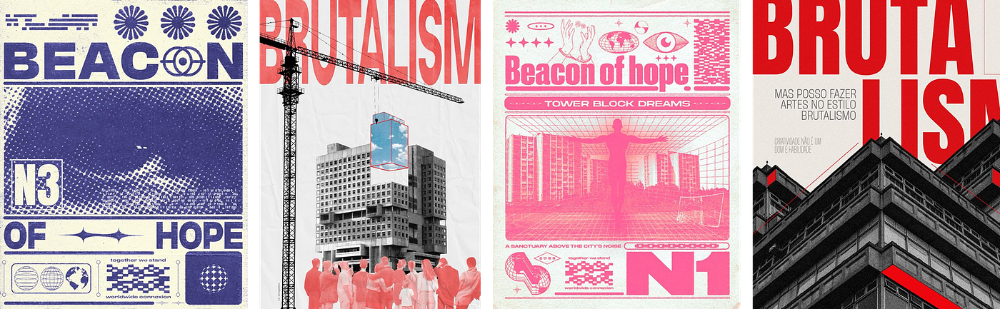

Brutalism in design is raw, bold, and purposefully unrefined. Borrowed from architecture, it rejects polish for stark functionality and visual honesty. In digital, it breaks UI norms to stand out.

- **Core Elements**: Monospaced fonts, grayscale palettes, harsh edges, solid blocks, default buttons.
- **Mood & Occasion**: Bold, disruptive, honest. Ideal for artist portfolios, experimental interfaces, or counterculture brands.

### 24. Cybercore

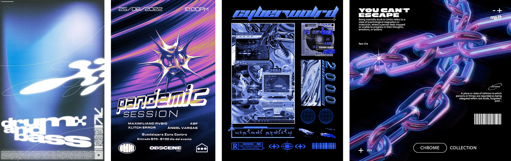

Cybercore is a high-tech, hyper-modern style drawing from hacker aesthetics, sci-fi, and the underground internet. It's visually complex and packed with futuristic iconography.

- **Core Elements**: Neon lights, glitch effects, code patterns, green/black themes, tech symbology.
- **Mood & Occasion**: Futuristic, chaotic, dystopian. Great for tech events, hacking culture, or gaming visuals.

### 25. Synthwave

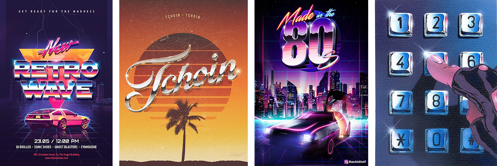

Synthwave is a retro-futuristic style inspired by 1980s sci-fi and synth music. It romanticizes a neon-lit future from a past era. Think "Tron" meets "Blade Runner" with a pink-purple glow.

- **Core Elements**: Grid horizons, VHS textures, neon gradients, 3D chrome type, purple and cyan palettes.
- **Mood & Occasion**: Retro-futuristic, vibrant, dreamy. Ideal for music visuals, arcade interfaces, or nostalgia apps.

### 26. Vaporwave

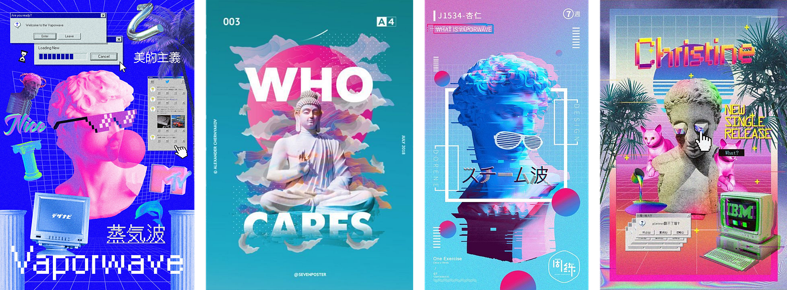

Vaporwave is a surreal, satirical style that critiques consumerism while celebrating 80s/90s nostalgia. It mixes classical statues with glitch art, Japanese characters, and retro software interfaces to create dreamlike visuals.

- **Core Elements**: Pastel pinks and purples, VHS glitch, Greek busts, MS Paint elements, Japanese text, lo-fi textures.
- **Mood & Occasion**: Ironic, dreamy, nostalgic. Ideal for indie music, visual art zines, or anti-establishment design.

### 27. Pop Art

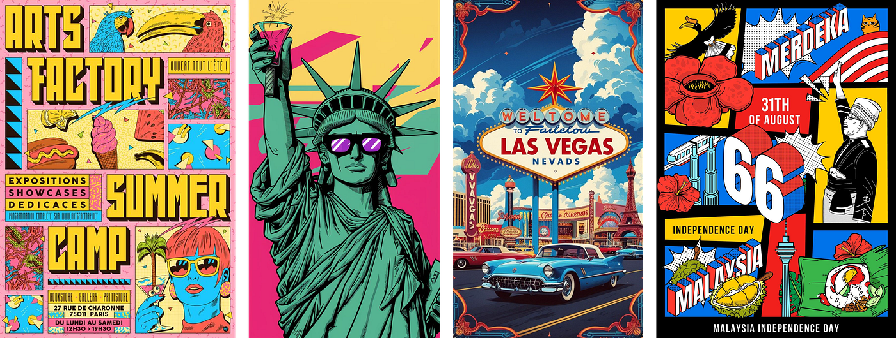

Pop Art draws inspiration from mass media, advertising, and comic books. It's bold, colorful, and meant to grab attention. Originating in the 1950s-60s, it blurs the line between high art and popular culture.

- **Core Elements**: Ben-Day dots, bold outlines, primary colors, comic sans or display fonts, speech bubbles.
- **Mood & Occasion**: Loud, fun, energetic. Great for pop culture campaigns, retail packaging, or fashion visuals.

### 28. Bento Box

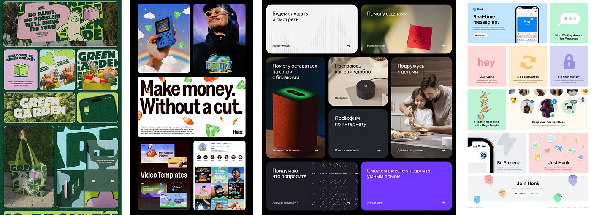

Bento UI is a trend in interface design that presents content in neatly organized, block-like sections — like compartments in a bento box. It makes complex layouts feel digestible and modern.

- **Core Elements**: Rounded modular blocks, subtle shadows, icons with labels, micro-animations, neutral palettes.
- **Mood & Occasion**: Organized, friendly, clean. Ideal for dashboards, portfolios, or productivity tools.

### 29. Graffiti

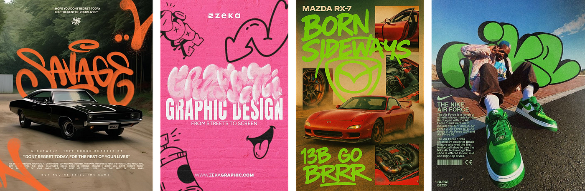

Graffiti design is rebellious, raw, and rooted in street culture. It's loud and expressive, often using urban textures and hand-painted type. It conveys energy and social voice.

- **Core Elements**: Spray paint textures, dripping letters, concrete backgrounds, neon colors, freestyle typography.
- **Mood & Occasion**: Urban, defiant, expressive. Best for streetwear brands, music festivals, or youth-centric campaigns.

### 30. Tenebrism

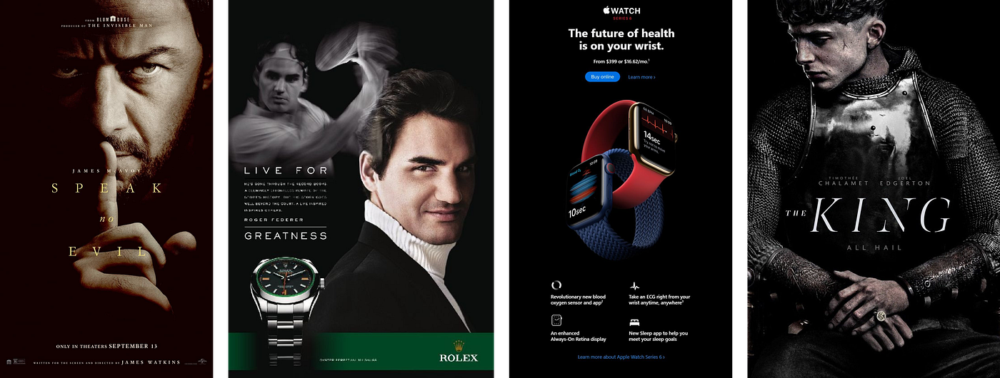

Tenebrism is a painting technique that uses dramatic lighting and intense contrasts between light and dark. In visual design, it creates depth, drama, and emotional weight.

- **Core Elements**: High contrast chiaroscuro, black backgrounds, spotlighting, oil textures.
- **Mood & Occasion**: Intense, emotional, moody. Ideal for gothic art, storytelling visuals, or cinematic posters.

### 31. Gothic

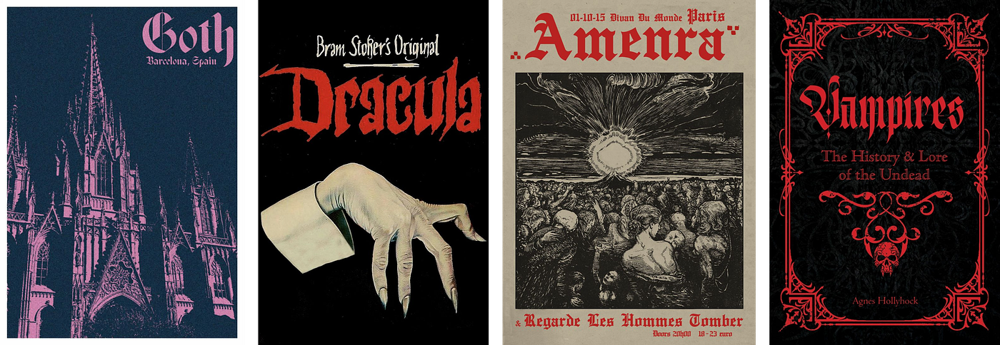

Gothic design is rooted in medieval architecture and dark romanticism. It's characterized by pointed arches, dark color palettes, and ornate lettering. It evokes mystery and spiritual depth.

- **Core Elements**: Blackletter fonts, stained glass textures, stone motifs, deep purples and blacks.
- **Mood & Occasion**: Dark, dramatic, historic. Perfect for fantasy book covers, music posters, or alternative fashion.

### 32. Pointillism

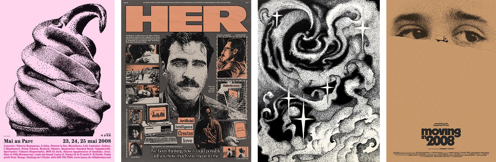

Pointillism is a painting technique using small dots of color to form an image. In design, it brings texture, detail, and a sense of movement or grain.

- **Core Elements**: Dot clusters, optical mixing, pastel or impressionist palettes, fade transitions.
- **Mood & Occasion**: Artistic, textured, tranquil. Great for fine art branding, creative editorials, or educational content.

### 33. Mixed Media

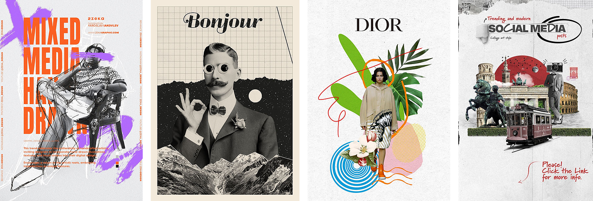

Mixed Media blends multiple visual styles and techniques — photography, illustration, textures — into one cohesive piece. It adds layers and depth, often evoking experimental or tactile storytelling.

- **Core Elements**: Cutouts, overlays, analog + digital collage, hand-drawn + photo elements, paper textures.
- **Mood & Occasion**: Eclectic, expressive, avant-garde. Ideal for magazines, experimental branding, or art education.

### 34. Steampunk

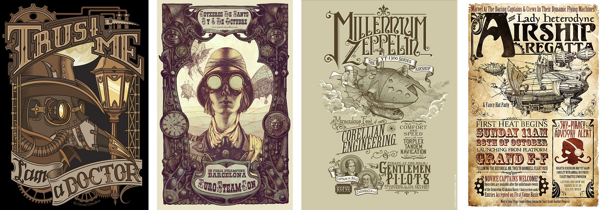

Steampunk fuses Victorian aesthetics with industrial-age machinery and sci-fi fantasy. It celebrates retro-futurism, with gears, brass, and corsets — all stylized in a mechanical world.

- **Core Elements**: Copper tones, cogwheels, leather, top hats, serif type, steam and smoke motifs.
- **Mood & Occasion**: Adventurous, vintage-futuristic, imaginative. Works well for games, books, or cosplay-related visuals.

### 35. Kawaii

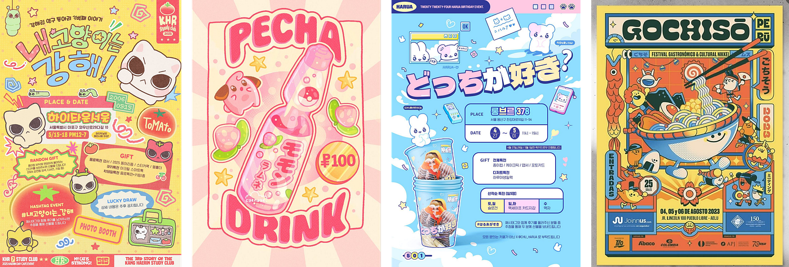

Kawaii is the Japanese culture of cuteness. It's childlike, cheerful, and full of charm. Designs often feature adorable characters with simple features, soft colors, and positive vibes.

- **Core Elements**: Pastel colors, rounded icons, baby faces, blushing cheeks, handwritten type.
- **Mood & Occasion**: Sweet, innocent, joyful. Great for stationery, kids' products, and whimsical branding.

### 36. Coquette

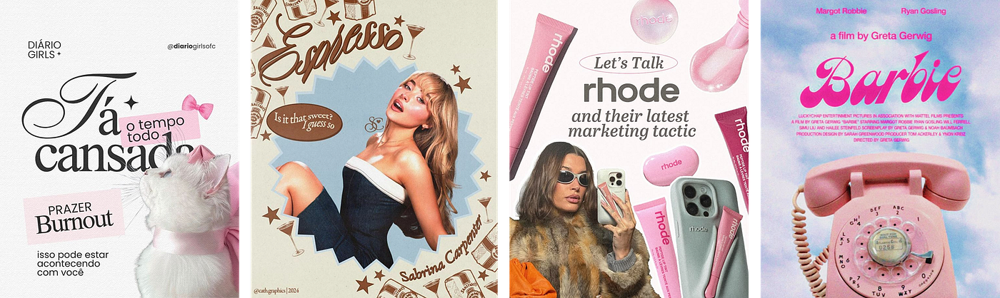

Coquette design is ultra-feminine and flirty with vintage undertones. It draws from early 2000s romantic aesthetics — think lace, bows, soft filters, and love letters.

- **Core Elements**: Baby pinks, pearls, ribbon motifs, dainty serif fonts, heart shapes.
- **Mood & Occasion**: Delicate, girly, nostalgic. Ideal for beauty brands, fashion reels, or romantic lifestyle blogs.

### 37. Surrealism

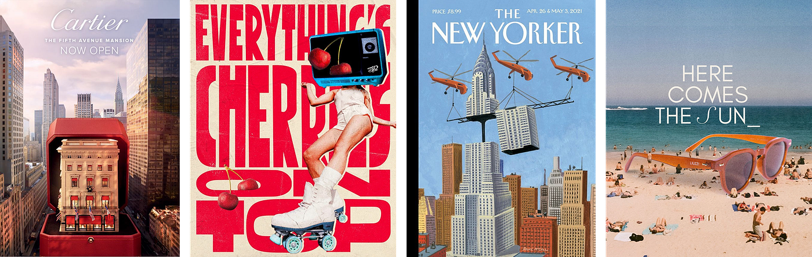

Surrealism breaks the boundaries of logic and realism. It thrives on dreamlike juxtapositions, abstract logic, and fantastical elements that challenge the viewer's sense of reality.

- **Core Elements**: Collage, disjointed objects, melting forms, metaphors, unexpected scale.
- **Mood & Occasion**: Dreamy, unsettling, thought-provoking. Best for concept art, experimental visuals, or literary design.

### 38. Utilitarian

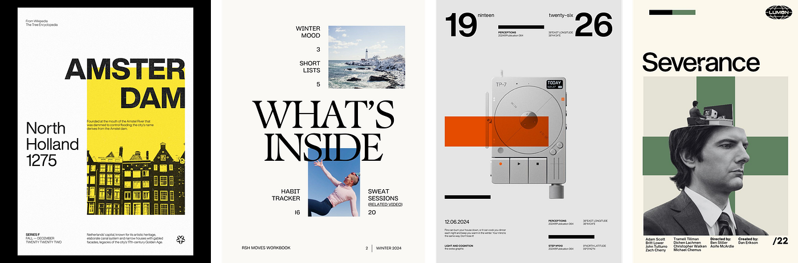

Utilitarian design is function-first, clean, and direct. It prioritizes clarity over aesthetics and often has a rugged, military-industrial feel.

- **Core Elements**: Grid layout, monospaced or industrial fonts, muted tones, absence of decoration.
- **Mood & Occasion**: Practical, minimal, efficient. Used in manuals, signage, utility apps, and technical interfaces.

### 39. Mid-Century

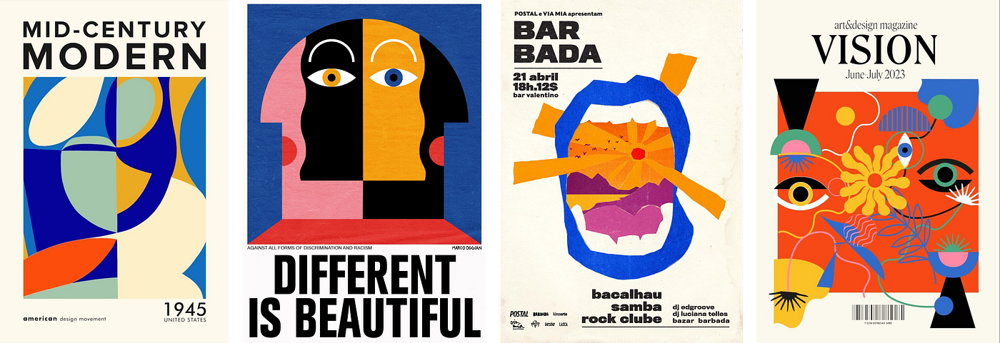

Mid-Century design is inspired by the 1940s–60s, emphasizing form, function, and organic simplicity. It blends bold geometry with warm textures and modern optimism.

- **Core Elements**: Clean lines, retro colors, boomerangs, mod patterns, sans-serif fonts.
- **Mood & Occasion**: Nostalgic, modernist, optimistic. Great for furniture branding, lifestyle blogs, or editorial layouts.

### 40. Scrapbook

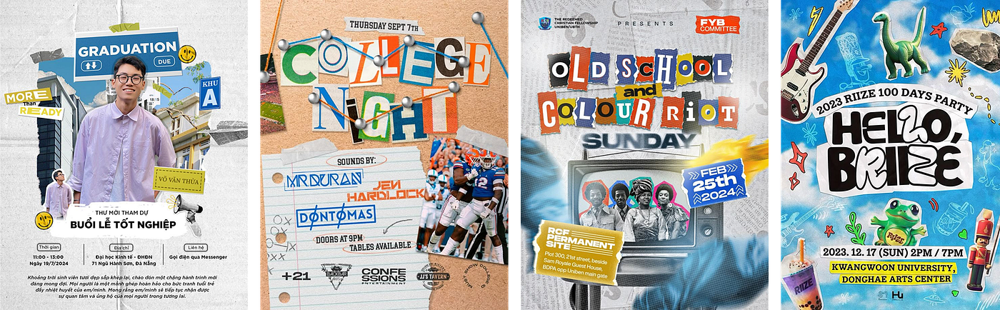

Scrapbook design mimics the handmade feel of collaging memories. It's personal, layered, and nostalgic, using tape, torn edges, and handwritten notes.

- **Core Elements**: Paper textures, washi tape, Polaroid frames, hand lettering, stickers.
- **Mood & Occasion**: Sentimental, warm, nostalgic. Ideal for journaling apps, memory branding, or school projects.

### 41. Neo Frutiger Aero

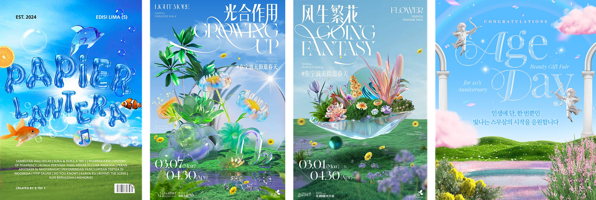

This is a Y2K revival sub-style mixing glossy UI elements, rounded sans-serifs like Frutiger, and bubble-like gradients. It's clean, futuristic, and retro at once.

- **Core Elements**: Aqua blues, semi-transparent bubbles, gloss overlays, friendly icons, rounded UI.
- **Mood & Occasion**: Futuristic, nostalgic, clean. Perfect for tech, playful fintech, or Web3 brands.

### 42. Dark Magic Academia

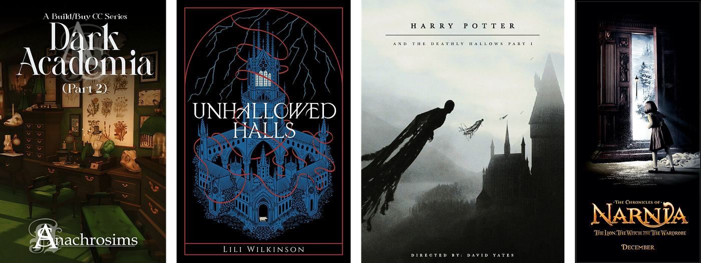

This style blends gothic academia with mysticism — like Harry Potter meets occult. It's dark, intellectual, and full of symbolism.

- **Core Elements**: Candles, spellbooks, antique etchings, black/gold palette, serif calligraphy.
- **Mood & Occasion**: Mysterious, scholarly, magical. Great for fantasy games, book clubs, or witchy brands.

### 43. Light Academia

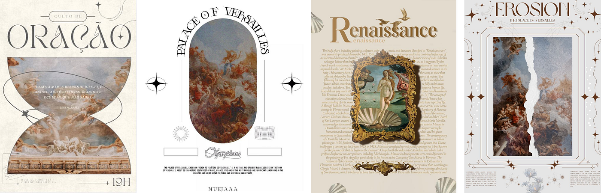

Light Academia is soft, poetic, and classical. It's like walking through a European library in summer. It romanticizes knowledge, literature, and aesthetics.

- **Core Elements**: Creamy neutrals, serif fonts, books, sunlight, linen textures.
- **Mood & Occasion**: Scholarly, calm, refined. Works for journals, study apps, or aesthetic fashion.

### 44. Wabi Sabi

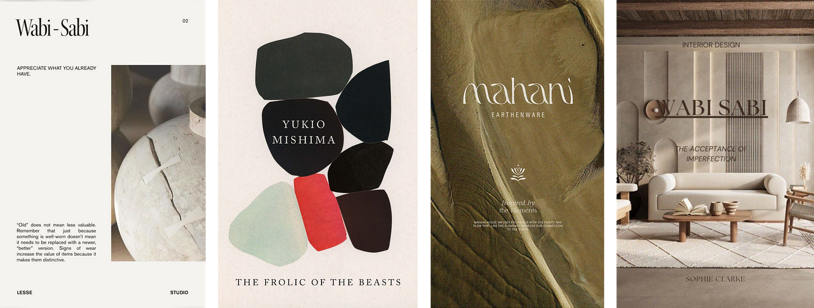

Wabi Sabi is a Japanese philosophy of embracing imperfection and impermanence. It values natural textures, asymmetry, and subtle beauty.

- **Core Elements**: Earthy tones, rough pottery textures, natural light, organic forms, minimal sans-serif.
- **Mood & Occasion**: Humble, calm, contemplative. Ideal for wellness brands, tea packaging, or mindful interfaces.

### 45. South West / Wild West

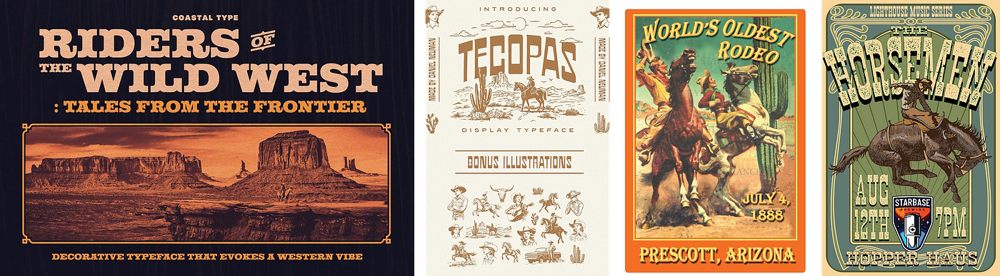

This style captures American desert landscapes, cowboy culture, and Native American influences. It's warm, rugged, and rooted in heritage.

- **Core Elements**: Terracotta, cacti, denim textures, cowboy boots, serif western fonts.
- **Mood & Occasion**: Rugged, adventurous, nostalgic. Best for ranch brands, outdoor gear, or festival posters.

### 46. Nautical

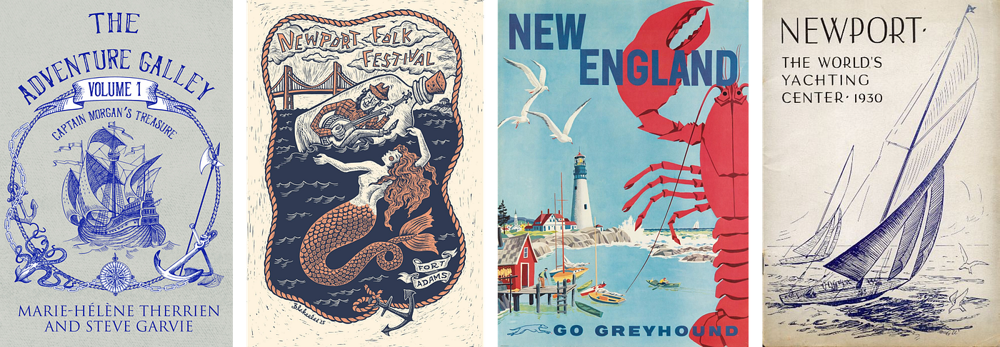

Nautical design is inspired by sea life, ships, and coastal living. It's fresh and orderly, with classic maritime elements and a palette drawn from ocean and sand.

- **Core Elements**: Navy and white, anchors, ropes, stripes, brass, serif or stencil fonts.
- **Mood & Occasion**: Fresh, structured, maritime. Perfect for seafood brands, beach resorts, or summer campaigns.

### 47. Rebus

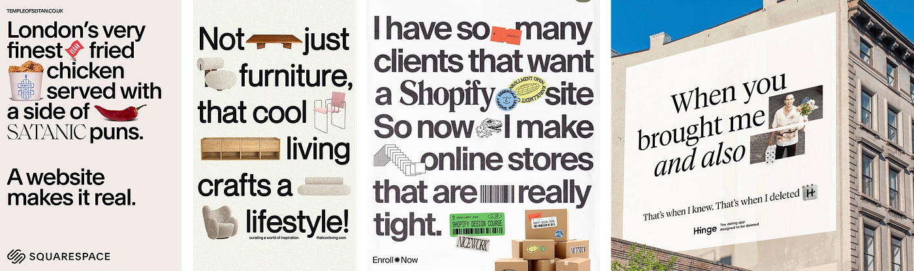

Rebus design communicates through symbols or images representing sounds or words. It's clever and interactive, often used for puzzles or branding.

- **Core Elements**: Pictograms, visual puns, image-type hybrids, clean layouts.
- **Mood & Occasion**: Witty, playful, intellectual. Works great for educational design, puzzles, or brand storytelling.

### 48. Glassmorphism

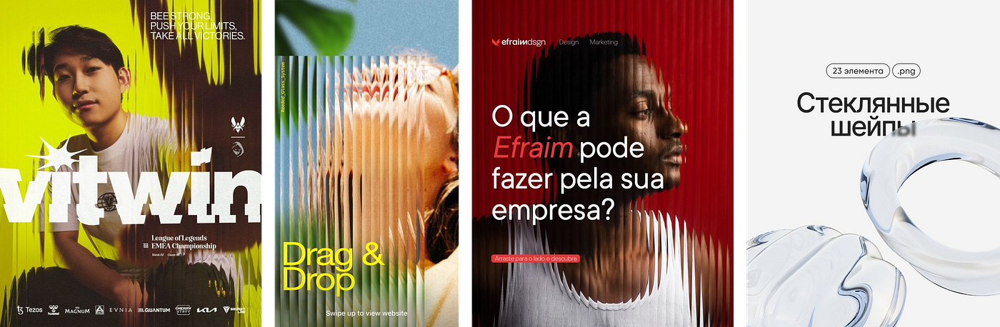

Glassmorphism gives UI elements a frosted glass look — transparent with blur and depth. It's soft, futuristic, and layered.

- **Core Elements**: Frosted backgrounds, blur effects, semi-transparency, soft shadows, neon tints.
- **Mood & Occasion**: Futuristic, elegant, sleek. Common in apps, OS UI, or product landing pages.

### 49. Modular Typography

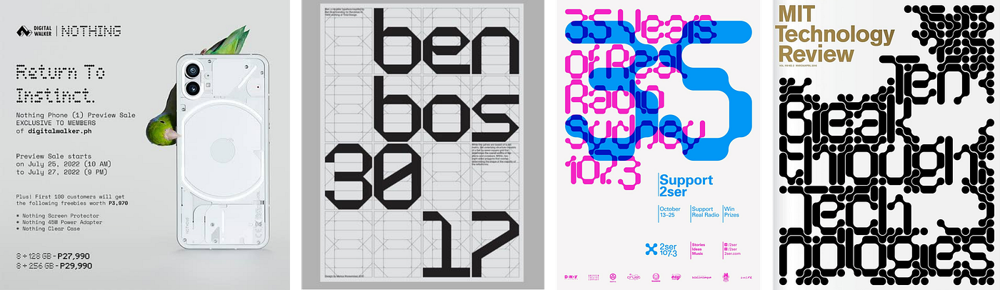

This style breaks type into grids or building blocks. It allows flexible systems and unique visual rhythm, often experimental in nature.

- **Core Elements**: Geometric letterforms, typographic grids, uniform spacing, variable layouts.
- **Mood & Occasion**: Structural, modern, playful. Works for posters, branding systems, and experimental typography.

### 50. Neo-Brutalism

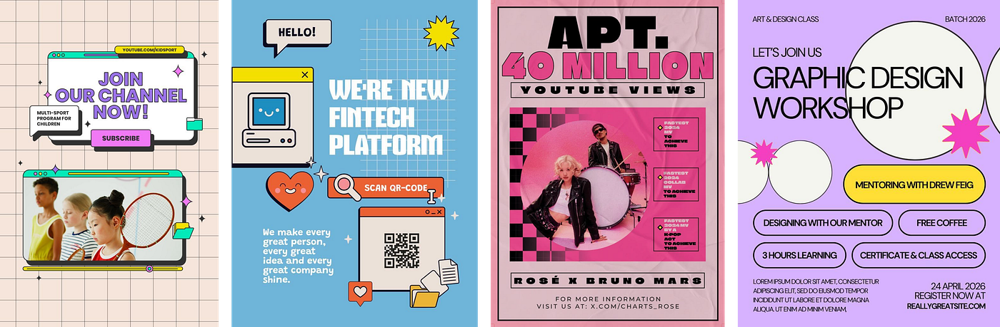

A cleaner, more structured evolution of classic Brutalism. It retains raw honesty but adds better UI practices — useful in digital products that want to be bold yet functional.

- **Core Elements**: Bold colors, large type, stark layouts, minimal UI components, purposeful asymmetry.
- **Mood & Occasion**: Confident, bold, raw-yet-usable. Ideal for design portfolios, creative agency sites, or digital magazines.

---

## How I Use This List With AI

1. **Prompt Smarter:** I now start my AI prompt with a style name, like "Ethereal UI design" or "Neo-Brutalist web layout." The AI instantly narrows its aesthetic.
2. **Mix Styles Like a Pro:** Once you know the DNA of each style, you can create hybrids like "Vaporwave x Gothic" or "Luxury Typography meets Aurora."
3. **Build Moodboards Faster:** If I want to show a client options, I just generate 3–4 styles for the same concept. Visual clarity = decision clarity.
4. **Brief Teams Effectively:** Whether it's motion designers or frontend devs, saying "Make it feel like Art Nouveau meets Kawaii" gets your message across way faster than trying to describe a vibe.

## Wrapping Up

Designers today aren't just creators, we're increasingly becoming **prompt architects**, **visual translators**, and **style conductors**. In a world where ideas are abundant but execution is AI-dependent, your power lies in how clearly you speak the language of design.

Having a rich visual vocabulary not only allows you to prompt effectively but it also empowers you to move beyond trends and apply style intentionally.

So next time you feel stuck while prompting or presenting a visual direction try using a style. The AI will listen. The client will understand. And your work will show it.

---

*Source: [50 Design Styles Every Designer Should Know for Better Prompting](https://uxplanet.org/50-design-styles-every-designer-should-know-for-better-prompting-56c09d55db62) by Himanshu Bhardwaj, UX Planet*
